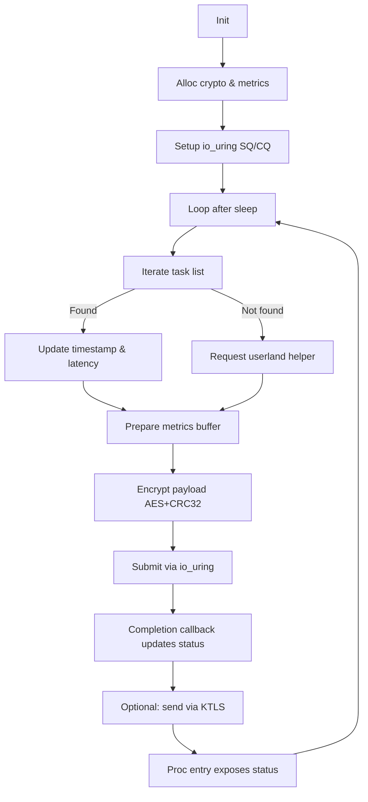
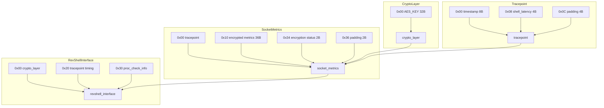

# Aphrodite


Aphrodite is a **Linux Kernel Module (LKM)** designed as a research exploring kernel-space monitoring, reverse shell invocation, and encrypted metrics collection. It leverages modern Linux kernel subsystems like `io_uring`, KTLS, and the Crypto API to demonstrate advanced persistence, stealth, and communication techniques.


## Table of Contents

1. [Overview](#overview)
2. [Core Components](#core-components)
3. [Structs and Data Flow](#structs-and-data-flow)
4. [Execution Flow](#execution-flow)
5. [Why These Subsystems?](#why-these-subsystems)
6. [Memory Layout](#memory-layout)
7. [End-to-End Flow Diagram](#end-to-end-flow-diagram)
8. [Low-Level Kernel Notes](#low-level-kernel-notes)
9. [Disclaimer](#disclaimer)

---

## Overview

Aphrodite hooks into the kernel to periodically:

* Monitor for specific processes (`expected_comm`)
* If not found, spawn a reverse shell (conceptually, not executable in this README)
* Record **timing and metrics** around operations
* Encrypt and submit these metrics using kernel crypto + io\_uring
---

## Core Components

### Process Monitoring

The kernel thread `mon_shell()` iterates over processes:

| Component                | Purpose                                 |
| ------------------------ | --------------------------------------- |
| `struct proc_check_info` | Holds expected process name and length. |
| `for_each_process()`     | Iterates task list under spinlock.      |

### Reverse Shell Invocation

* Uses `call_usermodehelper()` to invoke userland commands.
* Metrics record the latency of execution.

| Step              | Purpose                              |
| ----------------- | ------------------------------------ |
| Check for process | If found, update metrics             |
| Not found         | Request userland execution           |
| Record latency    | Track execution delay for monitoring |

> Exact reverse shell commands are omitted for safety.

### Encrypted Metrics

| Struct              | Fields                                             |
| ------------------- | -------------------------------------------------- |
| `tracepoint`        | `ktime_t timestamp`, `u32 shell_latency`           |
| `socket_metrics`    | Encrypted payload buffer + CRC + completion status |
| `encrypted_metrics` | AES-encrypted payload for reporting                |

Encryption is accelerated using AES-NI:

```c
if (cpu_has_aesni()) {
    crypto_sync(layer->encryption_key);
    metrics->metrics_encrypted[AES_KEY_LEN] =
        crc32_le(0, metrics->metrics_encrypted, AES_KEY_LEN);
}
```

### KTLS Integration

| Feature            | Purpose                                           |
| ------------------ | ------------------------------------------------- |
| KTLS               | Kernel-level TLS offload for encrypted metrics    |
| `tls_setsockopt()` | Configure cipher and keys                         |
| `tls_setup_sock()` | Prepare kernel socket for encrypted communication |

### io\_uring I/O Submissions

| Step                     | Purpose                          |
| ------------------------ | -------------------------------- |
| `io_uring_get_sqe()`     | Reserve submission slot          |
| `io_uring_prep_writev()` | Populate SQE with metrics buffer |
| `io_uring_submit()`      | Submit async I/O                 |
| Completion callback      | Update latency and status        |

---

## Structs and Data Flow

| Struct / Type        | Purpose                                        |
| -------------------- | ---------------------------------------------- |
| `crypto_layer`       | Holds AES key used for payload encryption      |
| `tracepoint`         | Timestamp and latency counters                 |
| `proc_check_info`    | Configured process monitoring info             |
| `socket_metrics`     | Aggregated metrics payload (encrypted)         |
| `revshell_interface` | Combines crypto, timing, and monitoring config |

---

## Execution Flow

1. **Module Init (`revshell_init`)**

   * Allocate crypto layer
   * Initialize `io_uring` queue
   * Start kernel thread `mon_shell`
   * Setup TLS socket (optional)
   * Register `/proc/revshell_metrics`

2. **Kernel Thread Loop**

   * Monitor processes
   * Spawn userland helper if target missing
   * Encrypt + submit metrics asynchronously
   * Sleep randomized interval (300–900s)

3. **Module Exit (`revshell_exit`)**

   * Stop kernel thread
   * Release `io_uring` resources
   * Remove `/proc` entry

---

## Why These Subsystems?

| Subsystem             | Why It’s Used                           |
| --------------------- | --------------------------------------- |
| `kthread`             | Runs monitoring logic in kernel context |
| Task list iteration   | Inspect living tasks safely             |
| Kernel-to-user helper | Safe userland execution from kernel     |
| Kernel Crypto API     | AES-NI accelerated encryption           |
| CRC32                 | Verify metric integrity                 |
| KTLS                  | Kernel-level encrypted transport        |
| io\_uring             | Non-blocking async metric submission    |
| `/proc` entry         | Expose runtime status/debug             |

---

## Memory Layout

| Struct               | Fields             | Offset | Size |
| -------------------- | ------------------ | ------ | ---- |
| `crypto_layer`       | AES key            | 0x00   | 32B  |
| `tracepoint`         | timestamp          | 0x00   | 8B   |
|                      | latency            | 0x08   | 4B   |
|                      | padding            | 0x0C   | 4B   |
| `socket_metrics`     | tracepoint         | 0x00   | 16B  |
|                      | metrics\_encrypted | 0x10   | 36B  |
|                      | encryption\_status | 0x34   | 2B   |
|                      | padding            | 0x36   | 2B   |
| `revshell_interface` | crypto\_layer      | 0x00   | 32B  |
|                      | tracepoint         | 0x20   | 16B  |
|                      | proc\_check\_info  | 0x30   | 16B  |

---

## End-to-End Flow Diagram



---

## Memory Diagram



---

## Low-Level Kernel Notes

* `spin_lock_irqsave()` prevents race conditions on `task_struct`.
* `ktime_get()` provides nanosecond timestamps.
* `io_uring` allows non-blocking async writes.
* AES-NI instructions accelerate encryption using CPU registers.
* Packed structs maintain predictable memory layout.


